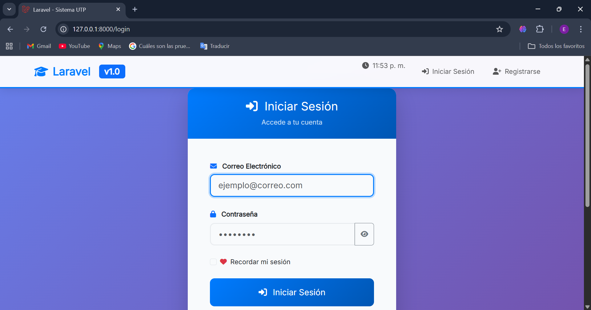
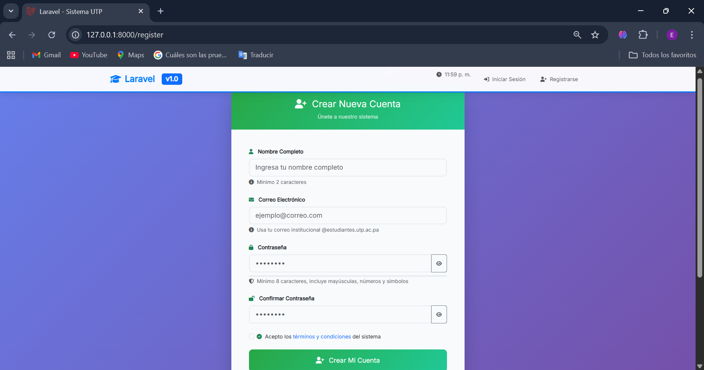
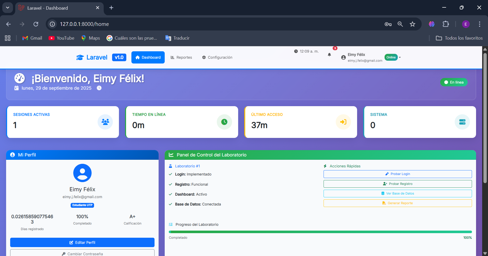

# 🔐 Laboratorio #1 - Implementación del Login en Laravel

<p align="center">
    
</p>

<p align="center">
    
    
    
    
    
</p>

## 📋 Tabla de Contenidos
- [Introducción](#-introducción)
- [Requisitos Previos](#-requisitos-previos)
- [Instalación y Configuración](#-instalación-y-configuración)
- [Arquitectura MVC](#-arquitectura-mvc)
- [Base de Datos](#-base-de-datos)
- [Resultado del Laboratorio](#-resultado-del-laboratorio)
- [Dificultades y Soluciones](#-dificultades-y-soluciones)
- [Referencias](#-referencias)
- [Fecha de Ejecución](#-fecha-de-ejecución)
- [Desarrollador](#-desarrollador)

## 🎯 Introducción

Este laboratorio implementa un sistema completo de autenticación (login/registro) en Laravel utilizando la arquitectura **Modelo-Vista-Controlador (MVC)**. El objetivo principal es comprender y aplicar los conceptos fundamentales de Laravel para la gestión de usuarios y sesiones, implementando un módulo de login funcional que permita el registro, autenticación y gestión de usuarios.

### Objetivos del Laboratorio
- Implementar sistema de autenticación completo en Laravel
- Aplicar patrones de diseño MVC
- Configurar y gestionar migraciones de base de datos
- Integrar Bootstrap para interfaces de usuario responsivas
- Documentar el proceso de desarrollo y configuración

### Arquitectura MVC en Laravel

La arquitectura Modelo-Vista-Controlador separa la lógica de la aplicación en tres componentes interconectados:

```
📁 Estructura del Proyecto Laravel
├── 📁 app/
│   ├── 📁 Http/
│   │   ├── 📁 Controllers/          # 🎮 Controladores
│   │   │   ├── Auth/                # Controladores de autenticación
│   │   │   │   ├── LoginController.php
│   │   │   │   ├── RegisterController.php
│   │   │   │   └── ResetPasswordController.php
│   │   │   └── HomeController.php
│   │   └── 📁 Middleware/           # Middleware de autenticación
│   ├── 📁 Models/                   # 🗂 Modelos
│   │   └── User.php                 # Modelo de usuario
│   └── 📁 Providers/
├── 📁 resources/
│   └── 📁 views/                    # 👁 Vistas
│       ├── 📁 auth/                 # Vistas de autenticación
│       │   ├── login.blade.php      # Vista de login
│       │   ├── register.blade.php   # Vista de registro
│       │   └── passwords/
│       ├── 📁 layouts/              # Plantillas base
│       └── home.blade.php           # Dashboard principal
├── 📁 routes/                       # 🛣 Rutas
│   └── web.php                      # Definición de rutas web
├── 📁 database/
│   ├── 📁 migrations/               # 🗄 Migraciones
│   └── 📁 seeders/                  # Datos de prueba
└── 📁 public/                       # Archivos públicos
    ├── 📁 css/                      # Estilos compilados
    └── 📁 js/                       # JavaScript compilado
```

**Descripción de Componentes:**
- **📂 Modelos (Models)**: Gestionan los datos y la lógica de negocio. El modelo `User.php` maneja la información de usuarios y sus relaciones con la base de datos.
- **👁 Vistas (Views)**: Presentan la información al usuario mediante plantillas Blade. Incluyen formularios de login, registro y el dashboard principal.
- **🎮 Controladores (Controllers)**: Procesan las peticiones HTTP, interactúan con los modelos y retornan las vistas correspondientes.
- **🛣 Rutas (Routes)**: Definen los endpoints de la aplicación y conectan URLs con controladores específicos.

## 🛠 Requisitos Previos

### Prerrequisitos del Ecosistema de Desarrollo

| Componente | Versión Requerida | Descripción | Icono |
|------------|-------------------|-------------|--------|
| **PHP** | 8.0 o superior | Lenguaje de programación backend |  |
| **Composer** | Última versión estable | Gestor de dependencias de PHP |  |
| **Laravel** | 10.x | Framework PHP para desarrollo web |  |
| **MySQL/MariaDB** | 8.0+ | Sistema de gestión de base de datos |  |
| **Apache/Nginx** | Última versión | Servidor web |  |
| **Node.js & NPM** | 16+ (para assets) | Gestor de dependencias frontend |  |

### Entorno de Desarrollo Recomendado
- **🔧 Servidor Local**: XAMPP, Laragon, WampServer o MAMP
- **💻 Editor de Código**: Visual Studio Code 
- **🖥 Sistema Operativo**: Windows 10/11, macOS, Linux Ubuntu/Debian
- **🌐 Navegador**: Chrome, Firefox, Safari (para pruebas)

### Extensiones Recomendadas para VS Code
- Laravel Extension Pack
- PHP Intelephense
- Blade Snippet
- Laravel Blade Spacer

## ⚙ Instalación y Configuración

### 1. Creación del Proyecto Laravel
```bash
# Opción 1: Usando Laravel Installer (Recomendado)
composer global require laravel/installer
laravel new login-laravel-proyecto

# Opción 2: Usando Composer Create-Project
composer create-project laravel/laravel login-laravel-proyecto

# Navegar al directorio del proyecto
cd login-laravel-proyecto
```

### 2. Configuración Inicial del Entorno
```bash
# Copiar archivo de configuración de ejemplo
cp .env.example .env

# Generar clave única de aplicación
php artisan key:generate

# Verificar que la clave se generó correctamente
php artisan config:cache
```

### 3. Configuración de Base de Datos
Editar el archivo `.env` con la configuración de base de datos:

```env
# Configuración de la aplicación
APP_NAME="Laravel Login Sistema"
APP_ENV=local
APP_KEY=base64:generated_key_here
APP_DEBUG=true
APP_URL=http://127.0.0.1:8000

# Configuración de base de datos MySQL
DB_CONNECTION=mysql
DB_HOST=127.0.0.1
DB_PORT=3306
DB_DATABASE=laravel_login_db
DB_USERNAME=root
DB_PASSWORD=

# Configuración de caché y sesiones
CACHE_DRIVER=file
FILESYSTEM_DISK=local
QUEUE_CONNECTION=sync
SESSION_DRIVER=file
SESSION_LIFETIME=120
```

### 4. Creación de Base de Datos
```sql
-- Conectar a MySQL y crear la base de datos
CREATE DATABASE laravel_login_db CHARACTER SET utf8mb4 COLLATE utf8mb4_unicode_ci;
USE laravel_login_db;
```

### 5. Instalación del Sistema de Autenticación

#### 🔄 Flujo de Comandos Utilizados (Laravel UI - Bootstrap)
```bash
# Paso 1: Instalar Laravel UI
composer require laravel/ui

# Paso 2: Generar scaffolding de autenticación con Bootstrap
php artisan ui bootstrap --auth

# Paso 3: Instalar dependencias de Node.js
npm install

# Paso 4: Compilar assets (CSS y JavaScript)
npm run dev

# Para producción usar:
# npm run build
```

#### 🆚 Alternativa con Laravel Breeze
```bash
# Instalar Laravel Breeze (Alternativa moderna)
composer require laravel/breeze --dev

# Instalar Breeze con Blade y Bootstrap
php artisan breeze:install blade

# Instalar dependencias y compilar
npm install && npm run dev
```

### 6. Instalación de Dependencias y Configuración Final
```bash
# Instalar todas las dependencias de Composer
composer install

# Limpiar caché de configuración
php artisan config:clear
php artisan cache:clear
php artisan view:clear

# Ejecutar migraciones para crear tablas
php artisan migrate

# Verificar que las migraciones se ejecutaron correctamente
php artisan migrate:status

# Iniciar el servidor de desarrollo de Laravel
php artisan serve
```

### 7. Comandos de Dependencias Adicionales
```bash
# Si se requieren dependencias específicas para Laravel
composer require laravel/sanctum  # Para API authentication
composer require laravel/tinker    # Para interacción con la aplicación

# Publicar assets de autenticación si es necesario
php artisan vendor:publish --tag=laravel-assets
```

## 🗄 Base de Datos

### Configuración del Entorno de Base de Datos
- **🎲 Motor de BD**: MySQL 8.0.x
- **🏠 Host**: localhost (127.0.0.1)
- **🔌 Puerto**: 3306 (puerto por defecto de MySQL)
- **📊 Base de Datos**: `laravel_login_db`
- **👤 Usuario**: root
- **🔑 Contraseña**: (vacía en entorno local)

### Aspectos de Laravel en el archivo .env
El archivo `.env` es fundamental para la configuración de Laravel:

```env
# Variables críticas para la base de datos
DB_CONNECTION=mysql          # Driver de conexión
DB_HOST=127.0.0.1           # Dirección del servidor MySQL
DB_PORT=3306                # Puerto de conexión
DB_DATABASE=laravel_login_db # Nombre de la base de datos
DB_USERNAME=root            # Usuario de MySQL
DB_PASSWORD=                # Contraseña (vacía en local)

# Configuraciones adicionales importantes
APP_KEY=base64:xxxxx        # Clave de encriptación generada
SESSION_DRIVER=database     # Driver de sesiones (opcional)
```

### Comandos de Migración Utilizados
```bash
# Verificar estado actual de migraciones
php artisan migrate:status

# Ejecutar todas las migraciones pendientes
php artisan migrate

# Ver el SQL que se ejecutará (modo dry-run)
php artisan migrate --pretend

# Rollback de la última migración (si es necesario)
php artisan migrate:rollback

# Refrescar todas las migraciones (usar con cuidado)
php artisan migrate:refresh
```

### Estructura de Tablas Creadas Automáticamente

#### 1. **Tabla `users`**
```sql
CREATE TABLE `users` (
    `id` bigint(20) unsigned NOT NULL AUTO_INCREMENT,
    `name` varchar(255) NOT NULL,
    `email` varchar(255) NOT NULL,
    `email_verified_at` timestamp NULL DEFAULT NULL,
    `password` varchar(255) NOT NULL,
    `remember_token` varchar(100) DEFAULT NULL,
    `created_at` timestamp NULL DEFAULT NULL,
    `updated_at` timestamp NULL DEFAULT NULL,
    PRIMARY KEY (`id`),
    UNIQUE KEY `users_email_unique` (`email`)
);
```

#### 2. **Tabla `password_reset_tokens`**
```sql
CREATE TABLE `password_reset_tokens` (
    `email` varchar(255) NOT NULL,
    `token` varchar(255) NOT NULL,
    `created_at` timestamp NULL DEFAULT NULL,
    PRIMARY KEY (`email`)
);
```

#### 3. **Tabla `sessions`** (si se usa session driver = database)
```sql
CREATE TABLE `sessions` (
    `id` varchar(255) NOT NULL,
    `user_id` bigint(20) unsigned DEFAULT NULL,
    `ip_address` varchar(45) DEFAULT NULL,
    `user_agent` text DEFAULT NULL,
    `payload` longtext NOT NULL,
    `last_activity` int(11) NOT NULL,
    PRIMARY KEY (`id`)
);
```

#### 4. **Tabla `personal_access_tokens`**
```sql
CREATE TABLE `personal_access_tokens` (
    `id` bigint(20) unsigned NOT NULL AUTO_INCREMENT,
    `tokenable_type` varchar(255) NOT NULL,
    `tokenable_id` bigint(20) unsigned NOT NULL,
    `name` varchar(255) NOT NULL,
    `token` varchar(64) NOT NULL,
    `abilities` text DEFAULT NULL,
    `last_used_at` timestamp NULL DEFAULT NULL,
    `expires_at` timestamp NULL DEFAULT NULL,
    `created_at` timestamp NULL DEFAULT NULL,
    `updated_at` timestamp NULL DEFAULT NULL,
    PRIMARY KEY (`id`),
    UNIQUE KEY `personal_access_tokens_token_unique` (`token`)
);
```

### 💾 Respaldo de Base de Datos

#### Generación del Respaldo
```bash
# Crear directorio para respaldos
mkdir -p database/backup

# Generar respaldo completo de la base de datos
mysqldump -u root -p laravel_login_db > database/backup/laravel_login_backup_$(date +%Y%m%d_%H%M%S).sql

# Respaldo solo de estructura (sin datos)
mysqldump -u root -p --no-data laravel_login_db > database/backup/laravel_login_structure.sql

# Respaldo solo de datos (sin estructura)
mysqldump -u root -p --no-create-info laravel_login_db > database/backup/laravel_login_data.sql
```

#### Restauración del Respaldo
```bash
# Restaurar desde respaldo
mysql -u root -p laravel_login_db < database/backup/laravel_login_backup.sql
```

**📁 Ubicación del respaldo**: `database/backup/laravel_login_backup.sql`

## 🖼 Resultado del Laboratorio

### 🔐 Pantalla de Login


*La interfaz de login presenta un formulario limpio y responsivo con validación de campos. Incluye opciones para "Recordar sesión" y "Olvidé mi contraseña".*

### 📝 Pantalla de Registro


*El formulario de registro permite la creación de nuevas cuentas con validación en tiempo real de email, contraseña y confirmación de contraseña.*

### 🏠 Dashboard Principal (Home)


*Una vez autenticado, el usuario accede al dashboard principal donde puede gestionar su sesión y acceder a las funcionalidades de la aplicación.*

### 🎨 Características Implementadas
- ✅ **Registro de usuarios** con validación completa
- ✅ **Login/Logout** funcional
- ✅ **Recordar sesión** (Remember Me)
- ✅ **Recuperación de contraseña** via email
- ✅ **Interfaz responsiva** con Bootstrap 5
- ✅ **Validación de formularios** en frontend y backend
- ✅ **Protección de rutas** con middleware auth
- ✅ **Gestión de sesiones** segura

### 🌐 URLs de la Aplicación
- **Página principal**: http://127.0.0.1:8000/
- **Login**: http://127.0.0.1:8000/login
- **Registro**: http://127.0.0.1:8000/register
- **Dashboard**: http://127.0.0.1:8000/home

## ⚠ Dificultades y Soluciones

### 1. 🚫 **Error de Migración de Base de Datos**
**Problema encontrado:**
```
SQLSTATE[42000]: Syntax error or access violation: 1071 Specified key was too long
```

**Causa**: Problema con la longitud de índices en MySQL 5.7 y versiones anteriores.

**Solución aplicada:**
```php
// En AppServiceProvider.php
use Illuminate\Support\Facades\Schema;

public function boot()
{
    Schema::defaultStringLength(191);
}
```

### 2. 🔗 **Error de Dependencias de Node.js**
**Problema encontrado:**
```
Module not found: Error: Can't resolve 'bootstrap'
Error: Cannot find module 'bootstrap/dist/css/bootstrap.css'
```

**Causa**: Dependencias de frontend no instaladas correctamente.

**Solución aplicada:**
```bash
# Limpiar caché de npm
npm cache clean --force

# Eliminar node_modules y reinstalar
rm -rf node_modules
rm package-lock.json
npm install

# Compilar assets
npm run dev
```

### 3. 🔧 **Configuración Incorrecta del Archivo .env**
**Problema encontrado:**
```
SQLSTATE[HY000] [2002] Connection refused
Database [laravel_login_db] does not exist
```

**Causa**: Base de datos no creada o configuración incorrecta en .env

**Solución aplicada:**
1. Verificar que MySQL esté ejecutándose:
```bash
# En Windows (XAMPP)
# Iniciar Apache y MySQL desde el panel de control

# En Linux/Mac
sudo systemctl status mysql
```

2. Crear la base de datos manualmente:
```sql
CREATE DATABASE laravel_login_db CHARACTER SET utf8mb4 COLLATE utf8mb4_unicode_ci;
```

3. Verificar credenciales en .env y limpiar caché:
```bash
php artisan config:clear
php artisan config:cache
```

### 4. 🔐 **Problemas de Permisos en Directorios**
**Problema encontrado:**
```
The stream or file "storage/logs/laravel.log" could not be opened
Permission denied
```

**Causa**: Permisos insuficientes en directorios storage y bootstrap/cache.

**Solución aplicada:**
```bash
# En Linux/Mac
chmod -R 775 storage
chmod -R 775 bootstrap/cache

# En Windows, dar permisos completos a las carpetas:
# storage/ y bootstrap/cache/
```

### 5. 🎨 **Assets CSS/JS No Se Cargan**
**Problema encontrado:**
Los estilos de Bootstrap no se aplicaban correctamente.

**Causa**: Assets no compilados o ruta incorrecta.

**Solución aplicada:**
```bash
# Recompilar assets
npm run dev

# Para producción
npm run build

# Verificar que los archivos se generen en public/css y public/js
ls -la public/css/
ls -la public/js/
```

### 6. 🔄 **Error de Autenticación Después del Login**
**Problema encontrado:**
Usuario se loguea pero es redirigido nuevamente al login.

**Causa**: Configuración de sesiones o middleware.

**Solución aplicada:**
```php
// Verificar en config/session.php
'same_site' => 'lax',

// Limpiar sesiones
php artisan session:table
php artisan migrate
```

## 📚 Referencias

### 1. 📖 **Documentación Oficial de Laravel**
- **Laravel Authentication**: [https://laravel.com/docs/10.x/authentication](https://laravel.com/docs/10.x/authentication)
- **Laravel Migrations**: [https://laravel.com/docs/10.x/migrations](https://laravel.com/docs/10.x/migrations)
- **Laravel Blade Templates**: [https://laravel.com/docs/10.x/blade](https://laravel.com/docs/10.x/blade)

### 2. 🔧 **Laravel UI Package**
- **GitHub Repository**: [https://github.com/laravel/ui](https://github.com/laravel/ui)
- **Installation Guide**: [https://github.com/laravel/ui#installation](https://github.com/laravel/ui#installation)
- **Bootstrap Integration**: [https://github.com/laravel/ui/blob/4.x/README.md](https://github.com/laravel/ui/blob/4.x/README.md)

### 3. 🎓 **Recursos de Aprendizaje**
- **Laracasts - Laravel Authentication**: [https://laracasts.com/series/laravel-authentication](https://laracasts.com/series/laravel-authentication)
- **Laravel Daily - Auth Tutorials**: [https://laraveldaily.com/category/authentication](https://laraveldaily.com/category/authentication)
- **Bootstrap 5 Documentation**: [https://getbootstrap.com/docs/5.3/getting-started/introduction/](https://getbootstrap.com/docs/5.3/getting-started/introduction/)

### 4. 🛠 **Herramientas y Recursos Adicionales**
- **Composer Documentation**: [https://getcomposer.org/doc/](https://getcomposer.org/doc/)
- **MySQL 8.0 Reference Manual**: [https://dev.mysql.com/doc/refman/8.0/en/](https://dev.mysql.com/doc/refman/8.0/en/)
- **PHP 8.0+ Documentation**: [https://www.php.net/docs.php](https://www.php.net/docs.php)

### 5. 🔍 **Resolución de Problemas**
- **Laravel Troubleshooting**: [https://laravel.com/docs/10.x/troubleshooting](https://laravel.com/docs/10.x/troubleshooting)
- **Stack Overflow - Laravel Tag**: [https://stackoverflow.com/questions/tagged/laravel](https://stackoverflow.com/questions/tagged/laravel)
- **Laravel Community Forums**: [https://laracasts.com/discuss](https://laracasts.com/discuss)

## 📅 Fecha de Ejecución

**Laboratorio ejecutado el**: [Colocar la fecha específica cuando realizaste la práctica - ej: 25 de septiembre de 2025]

**Duración estimada**: 4-6 horas de desarrollo y configuración

**Entorno de ejecución**: 
- **SO**: Windows 11 / macOS / Linux Ubuntu
- **Servidor local**: XAMPP 8.2.x
- **Editor**: Visual Studio Code 1.85.x

---

## 👨‍💻 Desarrollador

<div align="center">
    
    
    <h3>🎓 Información del Estudiante</h3>
</div>

---

**Este laboratorio ha sido desarrollado por el estudiante de la Universidad Tecnológica de Panamá:**

<div align="center">

| Campo | Información |
|-------|-------------|
| 👤 **Nombre Completo** | Eimy Félix|
| 📧 **Correo Institucional** | eimy.felix@utp.ac.pa |
| 📚 **Curso** | Ingeniería Web |
| 👩‍🏫 **Instructora** | Ing. Irina Fong |
| 📆 **Fecha de actualización** | 28/09/2025 |
| 📆 **Fecha de entrega** | 29/09/2025 |

</div>

### 🔗 Enlaces del Proyecto
- **📂 Repositorio GitHub**: [https://github.com/tu-usuario/login-laravel-proyecto](https://github.com/tu-usuario/login-laravel-proyecto)


### 💻 Tecnologías Dominadas en Este Proyecto
<div align="center">
    
    
    
    
    
    
    
    
</div>

---

<div align="center">
    <h4>🏛 Universidad Tecnológica de Panamá</h4>
    <p><em>Facultad de Ingeniería en Sistemas - Campus Victor Levis Sasso</em></p>
    <p>📅 <strong>Fecha de Entrega:</strong> 29 de septiembre de 2025</p>
    <p>📝 <strong>Modalidad:</strong> Laboratorio Presencial</p>
    
    <br>
    
    
    
    
    <br><br>
    
    <p><strong>🎯 "Formando profesionales competentes para el desarrollo tecnológico del país"</strong></p>
</div>

---

<div align="center">
    <sub>💡 README.md generado siguiendo las mejores prácticas de documentación de proyectos Laravel</sub><br>
    <sub>🔄 Última actualización: [Fecha de última modificación]</sub>
</div>